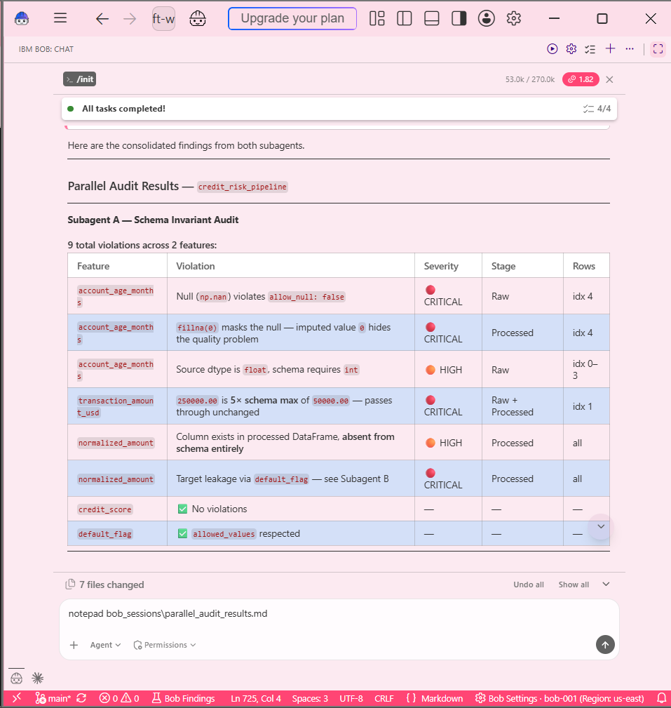
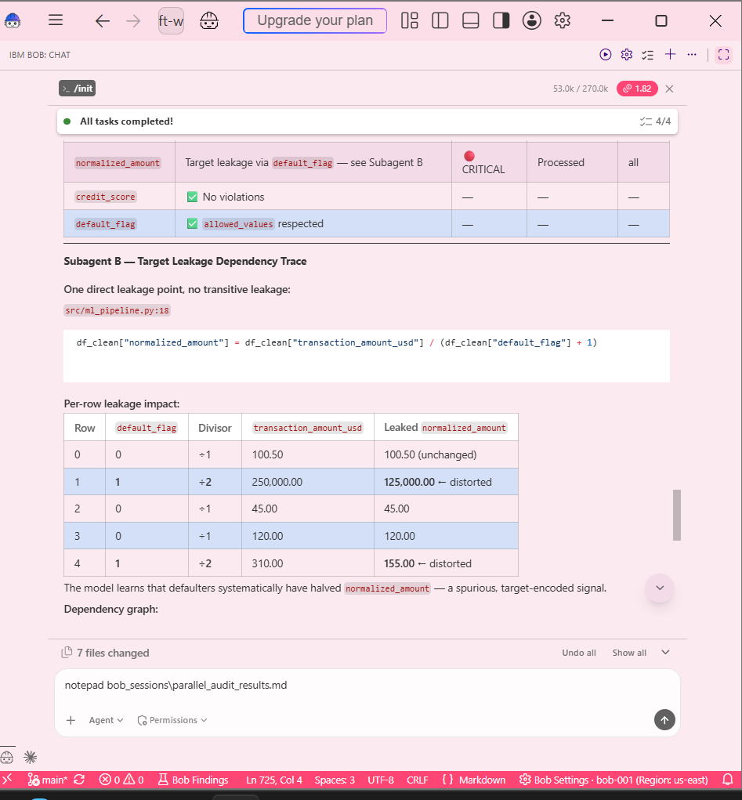

<div align="center">

# 🛡️ DRIFT WATCH
### **Autonomous MLOps Sentinel & Silent Failure Audit Engine**

[](https://cloud.ibm.com/)
[](https://cloud.ibm.com/watsonx)
[](https://www.python.org/)
[](https://streamlit.io/)
[](https://docs.pytest.org/)

**Intercept silent ML pipeline failures before they reach inference. Real-time target leakage detection, schema invariant enforcement, and 1-click agentic code remediation.**

[Problem](#-problem--motivation) • [Architecture](#-system-architecture) • [Features](#-key-features) • [IBM Bob Capabilities](#-ibm-bob-20-capability-demonstration) • [Proof](#-ibm-bob-usage-proof) • [Limitations](#-limitations) • [Future Work](#-future-work)

</div>

---

## ⚡ Problem & Motivation

Standard application monitoring relies on **HTTP Status Codes**. If a data pipeline returns `200 OK`, traditional software monitors mark the system as healthy.

However, Machine Learning pipelines suffer from **Silent Failure Corruption**:
* 🔴 **Target Leakage**: Consuming label fields (`default_flag`) at feature-engineering time yields high offline test accuracy while breaking completely in production.
* 🟠 **Unasserted Zero-Imputation**: Replacing `NaN` values with `0` masks missing data bugs while silently skewing feature distribution statistics.
* 🟠 **Out-of-Bounds Drift**: Ingesting values exceeding training limits without validation alerts leads to unpredictable inference outputs.

> **Drift Watch** bridges this observability gap by acting as an inline sentinel. It audits preprocessed feature arrays against explicit schema contracts (`schemas/feature_schema.yaml`), computes real-time **Pipeline Health Scores**, and generates 1-click code patches via **IBM Bob 2.0**.

---

## ⚙️ System Architecture

```text
 ┌──────────────────────┐      ┌──────────────────────┐      ┌──────────────────────┐
 │   Raw Ingestion      │      │ Engineered Pipeline  │      │   DriftSentinel      │
 │  (ml_pipeline.py)    ├─────►│  preprocess_features ├─────►│  (drift_sentinel.py) │
 └──────────────────────┘      └──────────────────────┘      └──────────┬───────────┘
                                                                        │
                                                                        ▼
 ┌──────────────────────┐      ┌──────────────────────┐      ┌──────────────────────┐
 │  1-Click Remediation │      │ Streamlit Dashboard  │      │ Schema Invariants    │
 │ (IBM Bob 2.0 Patch)  │◄─────┤   (Live Audit Engine)│◄─────┤ (feature_schema.yaml)│
 └──────────────────────┘      └──────────────────────┘      └──────────────────────┘
```

---

## ✨ Key Features

### 🌟 1. Autonomous Sentinel Engine (`DriftSentinel`)
* **Contract Enforcement**: Enforces bounds (`min`/`max`), column nullability (`allow_null`), and data types (`int`/`float`).
* **Heuristic Target Leakage Safeguard**: Detects derived normalized features that consume target parameters during inference data prep.

### 🎛️ 2. Production Streamlit Control Center
* **Interactive Anomaly Injector**: Live sidebar controls to toggle target leakage and test extreme feature value spikes dynamically.
* **Feature Distribution Charts**: Visual bar charts benchmarking engineered feature vectors against schema tolerance thresholds.
* **Automated Remediation Engine**: 1-click execution to apply IBM Bob 2.0 code fixes and instantly restore Pipeline Health to **100%**.

---

## 🤖 IBM Bob 2.0 Capability Demonstration

Drift Watch relies on three core capabilities of the IBM Bob 2.0 agentic framework:

```text
                  ┌──────────────────────────────────────────┐
                  │          IBM Bob 2.0 Orchestrator       │
                  └────────────────────┬─────────────────────┘
                                       │
         ┌─────────────────────────────┼─────────────────────────────┐
         ▼                             ▼                             ▼
┌───────────────────┐        ┌───────────────────┐        ┌───────────────────┐
│   Agent Mode      │        │  Subagents &      │        │     Document      │
│  Context & Rules  │        │  Parallel Tasks   │        │   Understanding   │
├───────────────────┤        ├───────────────────┤        ├───────────────────┤
│ Enforces directives│       │ Subagent A: Schema│        │ Ingests YAML schema│
│ defined in        │        │ Invariants        │        │ and markdown specs│
│ .bob/ rules       │        │ Subagent B: Target│        │ to generate checks│
│ hierarchy         │        │ Leakage Graph     │        │ & refactor code   │
└───────────────────┘        └───────────────────┘        └───────────────────┘
```

1. **Agent Mode**:
Operates under multi-layered system instructions (`.bob/rules-agent/`, `.bob/rules-plan/`, `.bob/rules-ask/`, and `AGENTS.md`) to autonomously execute code generation, refactoring, and test-driven fixes without manual intervention.

2. **Subagents & Parallel Task Delegation**:
Orchestrates concurrent audit subagents during analysis:
* **Subagent A (Schema Guard)**: Validates numeric range bounds (`min`/`max`), type constraints, and nullability flags against feature inputs.
* **Subagent B (Leakage Tracer)**: Concurrently inspects transformation pipelines for unasserted target dependencies across columns.

3. **Document Understanding**:
Parses structured operational documents directly — specifically `schemas/feature_schema.yaml` contract specifications and project `AGENTS.md` guidelines — to synthesize boundary rules and generate aligned unit assertions (`tests/test_pipeline_health.py`).

---

## 🎯 Addressing Hackathon Evaluation Criteria

| Evaluation Category | System Implementation & Proof |
| --- | --- |
| **Completeness & Feasibility** | End-to-end execution combining YAML schema contract definitions, Python audit logic, an interactive Streamlit dashboard, and complete PyTest coverage. |
| **Creativity & Innovation** | Addresses silent failure modes where pipelines return `HTTP 200 OK`-equivalent status while passing corrupted target leakage and drifted features into downstream inference. |
| **Design & Usability** | Dark-mode control center featuring live parameter sliders, severity alert badges, raw vs. processed table comparisons, and 1-click patch execution. |
| **Effectiveness & Efficiency** | Intercepts silent data corruption early in feature preprocessing to prevent unneeded model retraining and degraded production predictions. |

---

## 🧾 IBM Bob Usage Proof

Session logs, agent execution screenshots, and token consumption metrics generated by IBM Bob 2.0 are tracked and stored directly in source control under `bob_sessions/`:

* **Agent Directive Framework**: Configured via `.bob/rules-agent/AGENTS.md`, `.bob/rules-ask/AGENTS.md`, and `.bob/rules-plan/AGENTS.md`.
* **Token Metrics**: `53.0k / 270.0k Tokens` recorded across workspace context initialization, audit engine synthesis, and unit test generation (`bob_sessions/bob_sessions_token_usage.png`).
* **Required Task Session Summary**: Official Bob IDE task session summary (Task Id, Workspace, Bobcoins) captured per hackathon submission requirements (`bob_sessions/driftwatch_task01_init_summary.png`).
* **Audit Session Output**: Complete subagent finding report saved in `bob_sessions/parallel_audit_results.md`.
* **Pipeline Health Score**: Computed dynamically in `app.py` as `max(0, 100 - len(findings) * 35)`. With 2 unresolved critical findings pre-remediation, the score is `100 - (2 × 35) = 30%`; applying the Bob-generated patch clears the findings and restores the score to 100%.

### Subagent Execution Evidence

| Subagent A — Schema Invariant Audit | Subagent B — Target Leakage Trace |
| --- | --- |
|  |  |

---

## ⚠️ Limitations

* **Stateless Auditing**: The current `DriftSentinel` implementation audits micro-batches; it does not yet support windowed rolling statistics over real-time streaming data.
* **Heuristic Leakage Rules**: Target leakage detection relies on explicit target-vs-feature dependency rules rather than automated dynamic graph extraction.
* **Local Invariant Thresholds**: Bounds limits are defined manually within `feature_schema.yaml` rather than inferred automatically from historical statistical baseline distributions.

---

## 🔮 Future Work

* **CI/CD Integration**: Embed `DriftSentinel` checks into GitHub Actions pipelines to block bad PR merges before deployment.
* **Streaming Data Drift**: Extend sentinel support to Apache Kafka and IBM Event Streams for windowed streaming drift detection.
* **watsonx.ai Retraining Trigger**: Trigger automated model retraining and agentic code patching directly via IBM Cloud SDKs upon detecting severe health degradation.
* **Multi-Model Support**: Scale schema verification to handle multi-modal inputs and complex multi-model inference DAGs.

---

## 📁 Repository Blueprint

```text
drift-watch/
├── .bob/                       # IBM Bob Agent Workspace Directives
│   ├── rules-agent/AGENTS.md   # Coding rules & execution invariants
│   ├── rules-ask/AGENTS.md     # System documentation context
│   └── rules-plan/AGENTS.md    # Architecture constraints
├── bob_sessions/               # Token usage summaries & proof screenshots
│   ├── bob_subagents_execution.png
│   ├── bob_subagents_leakage_trace.png
│   ├── bob_sessions_token_usage.png
│   ├── driftwatch_task01_init_summary.png
│   └── parallel_audit_results.md
├── schemas/
│   └── feature_schema.yaml     # Schema contract specification
├── src/
│   ├── drift_sentinel.py       # Core Sentinel auditing engine
│   └── ml_pipeline.py          # Data pipeline with intentional target bugs
├── tests/
│   ├── conftest.py             # PyTest runtime setup
│   └── test_pipeline_health.py # Comprehensive unit test suite
├── AGENTS.md                   # System agent directives
├── app.py                      # Streamlit interactive dashboard
├── .env.example                # Credential template
└── README.md                   # Project documentation
```

---

## 🚀 Quickstart Guide

### 1. Clone & Environment Setup
```cmd
git clone https://github.com/maryamsohail32/drift-watch.git
cd drift-watch
cp .env.example .env
```

### 2. Install Dependencies
```cmd
pip install pandas numpy streamlit pytest pyyaml python-dotenv
```

### 3. Execute PyTest Health Checks
```cmd
pytest tests/
```

### 4. Launch Sentinel Dashboard
```cmd
streamlit run app.py
```

---

## 🔒 Security & Credential Protection

All cloud credentials, API keys, and workspace environment variables are managed securely through local `.env` overrides and explicitly excluded from git tracking via `.gitignore` and `.bobignore`.